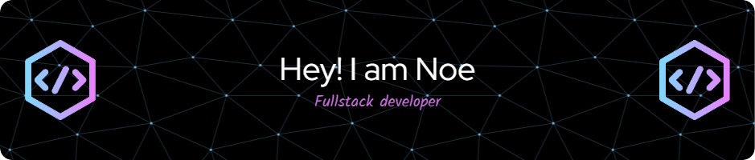

===========================================================================================================================

I am an information technology management engineering student and a full-stack freelance developer.

* 🌍  I'm based in Mexico
* ✉️  You can contact me at [1210198@alumno.um.edu.mx](mailto:1210198@alumno.um.edu.mx)
* 🧠  I'm learning Laravel, Spring Boot and others

## My Skill Set  
<table><tr><td valign="top" width="33%">

### Frontend  

  
  
  
  
  
  
  

</td><td valign="top" width="33%">

### Backend  

  
  
  
  
  
  

</td><td valign="top" width="33%">

### DevOps  

  
  
  
  
  

</td></tr></table>  

### Socials

 <a href="https://www.codepen.io/@noha09" target="_blank" rel="noreferrer"> <picture> <source media="(prefers-color-scheme: dark)" srcset="https://raw.githubusercontent.com/danielcranney/readme-generator/main/public/icons/socials/codepen-dark.svg" /> <source media="(prefers-color-scheme: light)" srcset="https://raw.githubusercontent.com/danielcranney/readme-generator/main/public/icons/socials/codepen.svg" />  </picture> </a> <a href="https://www.github.com/Noha09" target="_blank" rel="noreferrer"> <picture> <source media="(prefers-color-scheme: dark)" srcset="https://raw.githubusercontent.com/danielcranney/readme-generator/main/public/icons/socials/github-dark.svg" /> <source media="(prefers-color-scheme: light)" srcset="https://raw.githubusercontent.com/danielcranney/readme-generator/main/public/icons/socials/github.svg" />  </picture> </a>

### Badges

<b>My GitHub Stats</b>

<b>Top Repositories</b>

       
